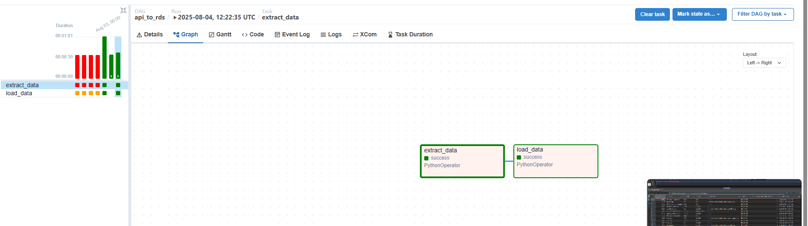
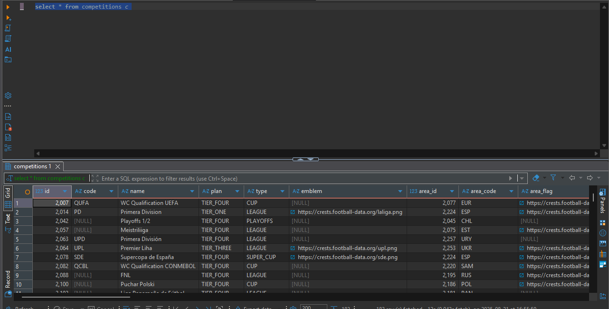
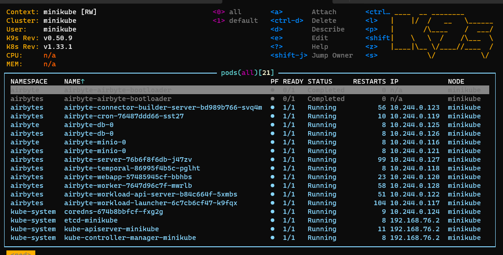
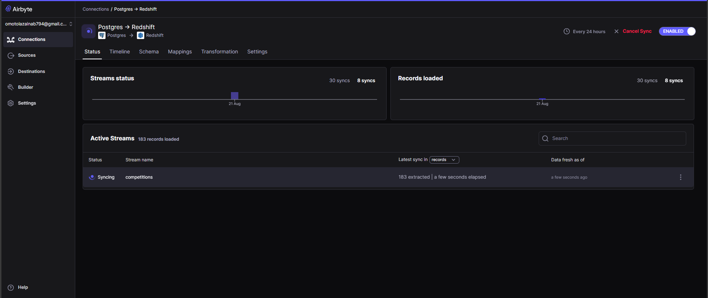

# ⚽ Data Pipeline For Football Competition

Football competitions — leagues, cups, and tournaments — fuel the global football economy.  
Behind every kickoff lies an ecosystem of **data flows**: competitions are scheduled, tracked, and analyzed across systems.  

This project brings that process to life by building a **scalable data pipeline**:  

- **Extracts competition data** from a football API  
- **Loads** it into **Postgres RDS** (via Dockerized Airflow)  
- **Replicates** it into **Amazon Redshift** (via Airbyte on Minikube)  
- **Automates & orchestrates** the entire journey with Airflow and Airbyte  


---

## 🏗️ Architecture  

```text
API (Football Competitions) 
       │
       ▼
Airflow DAG (Dockerized, Python)
       │
       ▼
Postgres RDS (Staging)
       │
   Airbyte (Minikube)
       │
       ▼
Amazon Redshift (Analytics)
```

- **Airflow (Dockerized)** → Extracts data from API → loads into RDS  
- **Airbyte** → Replicates data from RDS → Redshift  
- **Minikube** → Local Kubernetes cluster hosting Airbyte pods  
- **Redshift** → Analytics-ready warehouse  

📸 **Architecture Diagram**  
  

---

## 🔄 Data Flow  

1. **Airflow DAG** (running in Docker) extracts API data and writes it into RDS.  
2. **Airbyte connectors** replicate RDS → Redshift.  
3. **Redshift queries** (e.g., `SELECT * FROM competitions;`) confirm successful ingestion.  

---

## 📸 Pipeline Screenshots  

- **Airflow DAG**  
    

- **Redshift Query (`SELECT * FROM competition`)**  
    

- **Minikube Pods (Airbyte on Kubernetes)**  
    

- **Airbyte Sync UI**  
    

---

## 🚀 Quick Start  

### 1. Clone Repository  
```bash
git clone https://github.com/YOUR_USERNAME/football_competition_pipeline.git
cd football_competition_pipeline
```

### 2. Set Environment Variables  
Configure API and DB credentials:  
```bash
export API_KEY=your_api_key_here
export RDS_HOST=your_rds_host
export RDS_USER=your_rds_user
export RDS_PASSWORD=your_rds_password
export RDS_DB=football_competition
```

### 3. Run Airflow (Dockerized)  
```bash
# Start Airflow containers
docker-compose up -d

# Access Airflow UI
http://localhost:8080
```

Trigger your DAG:  
```bash
airflow dags trigger football_competition_dag
```

### 4. Start Airbyte on Minikube  
```bash
minikube start

kubectl get pods -n airbyte
```
Then configure the `RDS → Redshift` connection in Airbyte’s UI.  

### 5. Query in Redshift  
```sql
SELECT * FROM competitions LIMIT 10;
```

---

## 🛠️ Tech Stack  

- **Python** → API extraction scripts  
- **Apache Airflow (Dockerized)** → Containerized orchestration (API → RDS)  
- **Postgres RDS** → Staging database  
- **Amazon Redshift** → Analytics warehouse  
- **Airbyte (Minikube)** → ELT pipeline (RDS → Redshift)  
- **Terraform** → (Optional) Infrastructure provisioning  

---

## 📊 Use Cases  

With competition data in Redshift, analysts can:  
- Track **active competitions** across seasons  
- Compare **league growth across regions**  
- Power dashboards for **tournament analytics**  

---

## ✨ Closing Note  

This pipeline reflects how **real-world data platforms** integrate APIs, relational databases, ELT tools, and cloud warehouses.  
It is **guided by the principles of scalability, automation, and building scalable data platforms**, while telling the story of football competitions around the globe.  
