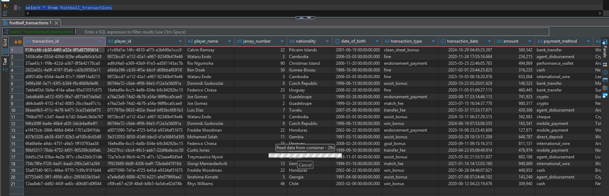

# ⚽ Football Transactions Data Pipeline  

Football is more than a game — it’s an industry powered by **data and money**.  
Behind every goal lies a world of **player transfers, salaries, performance bonuses, fines, and sponsorships**.  

This project simulates and processes those financial flows through a **cloud-native data pipeline** — turning raw transactions into **actionable insights**.  

Think of it as a **behind-the-scenes look at the business of football**, built with production-ready tools and **guided by the principles of scalability, automation, and cloud-native design**.  

---

## 🚀 Project Overview  

This pipeline demonstrates how **synthetic football transactions** (player transfers, match bonuses, fines, and more) flow through a modern data stack:  

```text
Synthetic Data (Python + Faker) → S3 (Data Lake) → Redshift (Warehouse)
Orchestrated with Apache Airflow | Provisioned with Terraform
```

- **Synthetic Data**: Generated with Python + Faker to simulate real-world financial transactions.  
- **Data Lake**: Raw data stored in **Amazon S3** for durability and cost efficiency.  
- **Data Warehouse**: Modeled and queried in **Amazon Redshift** for analytics.  
- **Orchestration**: Managed end-to-end with **Apache Airflow DAGs** (running in Docker).  
- **Infrastructure**: Provisioned using **Terraform**, ensuring reproducibility and automation.  

---

## 🏗️ Architecture  

 

1. **Data Generation**  
   - `faker_to_s3_etl.py` creates realistic football-related financial transactions.  

2. **Data Orchestration**  
   - Apache Airflow DAGs schedule & manage tasks:
     - Generate → Store in S3 → Load into Redshift.  

3. **Data Storage**  
   - **S3** holds raw PARQUET data.  
   - **Redshift** stores transformed, query-ready tables.  

4. **Infrastructure**  
   - **Terraform** modules (`vpc_stack.tf`, `s3_bucket.tf`, `redshift_cluster.tf`) provision AWS resources.  

---

## 📊 Data Flow in Action  

### 🔹 Airflow DAG Orchestration  
Here’s the DAG that orchestrates the pipeline — from **synthetic data generation → S3 ingestion → Redshift loading**:  

  

---

### 🔹 Querying Football Transactions  
Once data lands in **Redshift**, we can query it like any production-grade warehouse:  

```sql
SELECT *
FROM football_transactions
LIMIT 20;
```  

And here’s a sample result set 👇  

  

---

## ⚡ Quick Start  

Follow these steps to replicate the project locally:  

### 1️⃣ Clone the Repository  
```bash
git clone https://github.com/yourusername/football-transactions-pipeline.git
cd football-transactions-pipeline
```

### 2️⃣ Spin Up Airflow with Docker  
```bash
docker-compose up -d
```

### 3️⃣ Provision AWS Infrastructure with Terraform  
```bash
cd terraform_infra
terraform init
terraform apply
```

### 4️⃣ Run the Pipeline  
- Trigger the DAG via **Airflow UI** (`http://localhost:8080`).  
- Synthetic data will be generated → stored in **S3** → loaded into **Redshift**.  

### 5️⃣ Query Data in Redshift  
Use your favorite SQL client:  
```sql
SELECT player_name, transaction_type, amount, payment_method
FROM football_transactions
WHERE transaction_date >= '2024-01-01'
ORDER BY amount DESC;
```

---

## 🛠️ Tech Stack  

- **Language**: Python  
- **Workflow Orchestration**: Apache Airflow (Dockerized)  
- **Data Lake**: Amazon S3  
- **Data Warehouse**: Amazon Redshift  
- **Infrastructure as Code**: Terraform  
- **Libraries**: Faker, Pandas, AWS Wrangler  

---

## 🌟 Why This Project Matters  

- Shows how **raw events** (transactions) can be turned into **queryable insights**.  
- Demonstrates **real-world data engineering practices**: orchestration, automation, IaC, cloud-native design.  
- Blends **storytelling with engineering** — making the pipeline both relatable and production-ready.  

---

